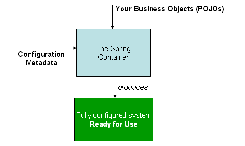
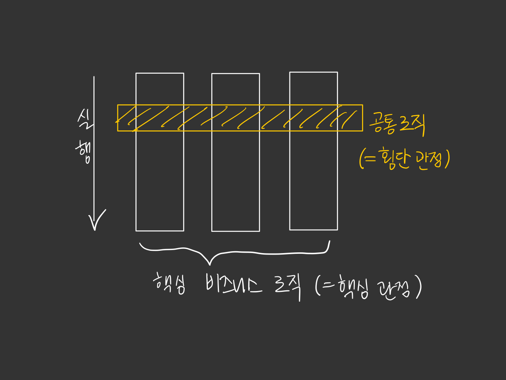
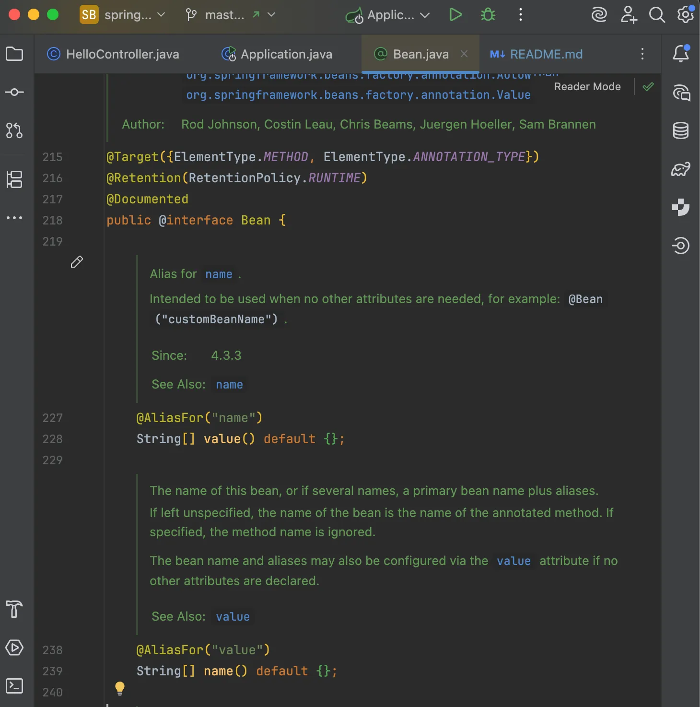
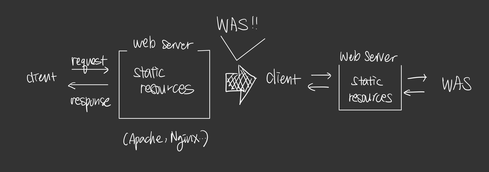
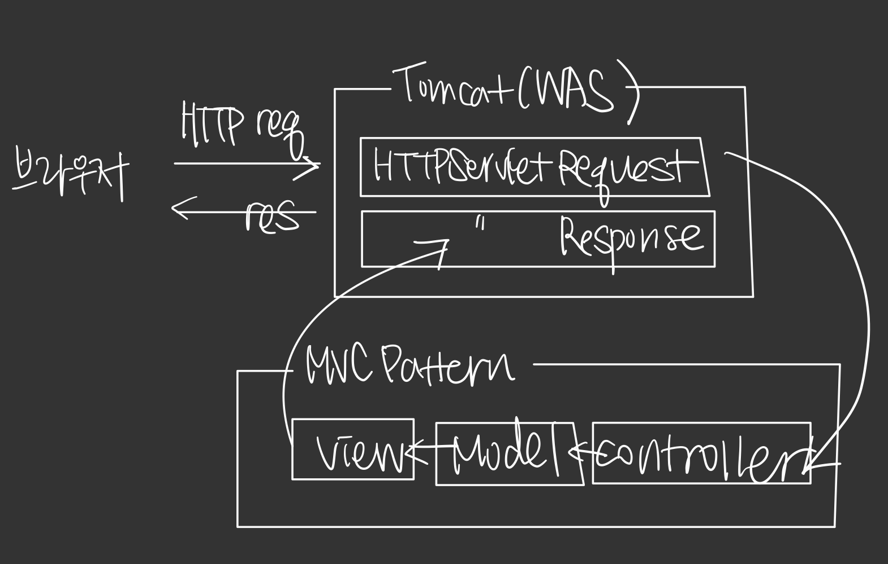
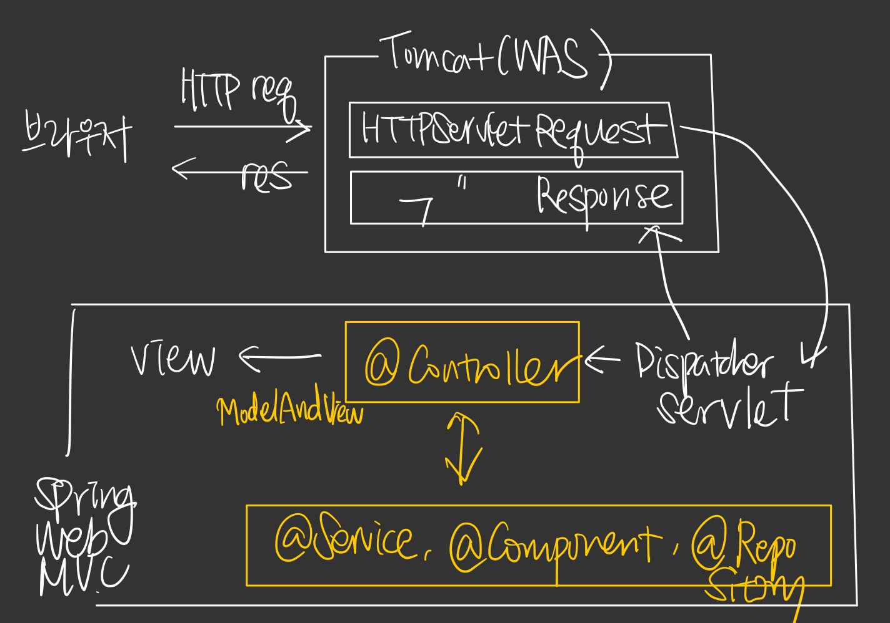

# 1주차 미션

## IoC (Inversion of Control)
객체의 생성과 관리를 개발자가 아닌 프레임워크가 담당하는 개념

- 개발자는 필요한 객체들만 선언해 두고, Spring이 적절한 객체를 주입하는 형태이다.

    

### IoC 컨테이너 작동 방식
1. 객체를 class로 정의한다
2. 객체들 간의 연관성 지정: Spring 설정 파일(Config) 또는 어노테이션(`@Component` , `@Configuration`, `@Autowired`, `@Bean` )을 통해 객체들이 어떻게 연결될지(의존성 주입) 지정한다.
3. IoC 컨테이너가 이 정보를 바탕으로 객체들을 생성하고, 필요한 곳에 주입한다

## DI (Dependency Injection)
객체 간의 의존성을 프레임워크가 주입하는 개념

- 객체가 직접 의존하는 객체를 생성하거나 참조하는 대신, 이러한 의존성을 외부에서 주입받도록 한다.

### DI를 사용하지 않으면
아래 코드와 같이 UserService는 UserRepository를 직접적으로 생성하고 의존하므로, 이 둘 사이에 Tight Coupling이 생기게 된다.
이 경우 코드 변경이 생기면 여러 클래스를 전부 바꿔야 할 수 있다.
```
public class UserService {
    private UserRepository userRepository;

    public UserService() {
        this.userRepository = new UserRepository();  
    }
    
    // ...
}
```

### Spring의 의존성 주입 방식
**1. 생성자 주입**
- 생성자 기반 DI는 컨테이너가 종속성을 나타내는 여러 인수로 생성자를 호출해 객체를 생성한다.
  - 생성자는 객체가 생성될 때 필수적인 필드값을 보장하기 때문에, 의존성이 없는 객체를 만들 수 없다. 
- 객체의 불변성을 보장한다.
```
public class UserService {
    private UserRepository userRepository;

    @Autowired
    public UserService(UserRepository userRepository) {
        this.userRepository = userRepository;
    }
    
    // ...
}
```

**2. setter 주입**
- 런타임에 의존성을 주입하는 방식이므로, 의존성이 없더라도 객체가 생성될 수 있다. (<-> 생성자 주입)
    - 따라서 선택적 의존성 주입이 가능하지만, 필수적인 의존성이 주입되어야 하는 경우에 강제할 수 없다.
    - 따라서 필요한 빈을 주입받지 않은 채 작동할 수 있기 때문에 NullPointException 등의 에러에 유의해야 한다.

**3. 필드 주입**
- setter 주입과 마찬가지로 런타임에 의존성을 주입한다.
- 필드에 직접 주입되기 때문에 테스트 중 의존성 주입이 어렵다.
- 의존성 관계가 명시적으로 드러나지 않기 때문에 빈들 간의 순환 참조 문제가 발생할 수 있다.

## AOP (Aspect Oriented Programming)
프로그램의 구조를 관점(aspect) 기준으로 공통된 모듈로 분리하는 방법

객체 지향 프로그래밍에서 모듈 단위는 클래스인 것처럼, 관점 지향 프로그래밍에서 모듈 단위는 '관점'이다.
클래스 관점 모듈 모두 자바 클래스로 작성하지만, 이 둘은 개념과 공통 모듈 처리 방식이 다르고 상호 보완적으로 동작한다.

AOP에서는 핵심 로직들을 구현한 코드에서 공통 기능을 직접 호출하지 않는다.
AOP에서는 분리한 공통 기능의 호출까지도 관점으로 다루며, 이런 모듈로 산재한 관점을 횡단 관점이라고 부른다.


## PSA (Portable Service Abstraction)
서비스 기능에 접근하는 방식 자체를 일관되게 유지하면서 기술 자체를 유연하게 사용할 수 있도록 하는 것

- 어떤 서비스를 이용하기 위한 접근 방식을 일관된 방식으로 유지함으로써 애플리케이션에서 사용하는 기술이 변경되더라도 최소한의 변경만으로 변경된 요구 사항을 반영하기 위해 필요하다. 즉, PSA를 통해 애플리케이션의 요구 사항 변경에 유연하게 대처할 수 있다.

<hr />

## 어노테이션(annotation)이란
코드에게 부가적인 정보를 제공하기 위해 사용되는 방법. 

자바 어노테이션은 클래스 파일에 임베디드 되어 컴파일러에 의해 생성된 후 JVM에 포함되어 동작한다.
즉, 과거에는 자바 코드 & XML 설정 파일이 각 버전에 맞게 각각 존재했다면 이제는 `@`를 통해 관리하며 하나의 파일에서 코드와 설정을 관리할 수 있게 된 것이다.

어노테이션은 주로 컴파일러에게 특정 작업을 수행하도록 지시하거나, 런타임에 프로그램의 동작을 변경하거나, 코드 분석 도구에게 정보를 제공하는 데 사용된다.
또한 커스텀하게 만들어 특정 기능을 수행하도록 사용자가 원하는 메타 데이터를 추가할 수도 있다.

자바에서 어노테이션은 크게 세 가지로 분류된다.
표준(내장) 어노테이션, 메타 어노테이션, 그리고 사용자 어노테이션이다.

1. 표준 어노테이션
    - `@Override` : 오버라이딩을 올바르게 했는지 컴파일러가 체크
    - `@Deprecated` : 앞으로 사용하지 않을 것을 권장하는 필드나 메서드에 작성
    - `@SuppressWarnings` : 컴파일러의 경고 메시지가 나타나지 않게 함
2. 메타 어노테이션 (어노테이션 정의에 사용)
   - `@Target` : 어노테이션 정의 시, 적용 대상 지정에 사용
   - `@Retention` : 어노테이션 유지 기간 지정 (_SOURCE_, _RUNTIME_, _CLASS_)
   - `@Inherited` : 어노테이션이 상속 가능하도록 지정
   - `@Documented`: 어노테이션이 javadoc에 포함되도록 표시
3. 사용자 정의 어노테이션을 생성하려면
    - `@interface` 키워드 사용
    - 속성 추가
    - 유지 정책 설정 및 적용 대상 지정

## Spring Bean 
Spring IoC 컨테이너가 관리하는 객체

- 의존성 주입이 필요한 객체를 빈으로 등록하여 Spring IoC 컨테이너가 객체의 생성과 의존성 주입을 관리하도록 한다.

### Spring IoC 컨테이너가 빈을 관리하는 방법
```
객체 생성 + property 설정 -> 의존 설정 -> 초기화 -> 사용 -> 소멸
```

1. Spring IoC 컨테이너가 생성되면, 빈 스코프가 싱글톤인 객체를 생성한다.
2. 빈으로 등록하기 위해 다음과 같은 configuration 메타 데이터를 이용해 bean definition을 생성한다.
   - **Annotation**
   - Java config (설정 클래스)
   - xml 
3. 빈으로 등록할 POJO와 앞서 만든 bean definition 정보를 이용해 빈을 생성한다.
4. 빈 객체가 생성되면 IoC 컨테이너는 의존 설정을 한다. 이때 일어나는 게 **DI(의존성 자동 주입)**이다.
5. 객체 초기화를 진행한다.
   - 모든 객체에 필요한 건 아니다. connection pool과 같이 사용 전에 초기화 과정이 필요한 객체에서 진행한다.
6. 빈 사용 
7. 사용이 끝나면 빈 소멸

<br />

#### (추가) `@Bean` 어노테이션
자바 설정 클래스에서 스프링 빈 정의 시 사용. (하지만 자동으로 스프링 빈을 등록하는 컴포넌트 스캔이 훨씬 편하다)

- `@Target({ElementType.METHOD, ElementType.ANNOTATION_TYPE})` : 어노테이션을 정의할 수 있는 타겟은 메서드와 다른 어노테이션
  - 따라서 메서드 선언부에 정의해야 한다.
- `@Retention(RetentionPolicy.RUNTIME)` : 런타임 시점까지 해당 어노테이션이 코드에 존재
- ```
    @AliasFor("name")
    String[] value() default {};


	   @AliasFor("value")
	   String[] name() default {};
  ```
  : 스프링 빈의 이름을 별도로 설정할 때 사용하는 설정으로, value 또는 name 속성을 가질 수 있다. (필수 X)

### 컴포넌트 스캔
`@Component` 어노테이션이 붙은 클래스를 스캔해서 스프링 빈으로 등록

1. `@ComponentScan`
   - `@ComponentScan`은 `@Component`가 붙은 모든 클래스를 스프링 빈으로 등록한다.
2. `@Autowired` 의존관계 자동 주입
   - 생성자에 `@Autowired`를 지정하면, 스프링 컨테이너가 자동으로 해당 스프링 빈을 찾아서 주입한다.

컴포넌트 스캔의 대상은 다음과 같다. (나머지를 까보면 모두 `@Component`를 포함하고 있다. 컴포넌트 스캔 뿐만 아니라 부가 기능이 함께 수행된다.)
- `@Component` : **컴포넌트 스캔**
- `@Controller` : 스프링 MVC 컨트롤러로 인식
- `@Service` 
- `@Repository` : 스프링 데이터 접근 계층으로 인식. 데이터 계층 예외를 스프링 예외로 변환
- `@Configuration` : 스프링 설정 정보로 인식. 스프링 빈이 싱글톤을 유지하도록 추가 처리

## 하나의 interface에 대한 구현체가 여러 개일 때 DI 컨테이너의 주입 방식
Spring 자동 주입을 하게 되면 해당 타입의 빈이 여러 개가 되기 때문에 주입하려는 빈을 찾을 수 없어 **NoUniqueBeanDefinitionException**이 발생한다. 

따라서 우선 순위를 지정하거나, 추가적인 판단을 할 수 있는 정보를 명시적으로 제공하는 방법을 사용하여 에러를 해결할 수 있다.

1. `@Primary` : 우선 순위를 지정하는 방식
- 먼저 찾고자 하는 클래스에 어노테이션을 붙여 `@Autowired` 시 우선적으로 빈을 찾게 한다.

2. `@Qualifier` : 스프링 컨테이너가 여러 개의 빈을 찾았을 때, 추가적으로 판단할 수 있는 정보를 준다.
   - `@Qualifier`가 `@Primary`보다 우선순위가 높다.

- 예시 상황을 들자면 코드에서 자주 사용하는 메인 데이터베이스 커넥션을 사용하는 빈이 있고, 가끔 사용하는 서브 데이터베이스의 커넥션이 있을 때
  - 메인 데이터베이스 커넥션을 사용하는 빈은 -> `@Primary`로 기본 설정
  - 서브 데이터베이스 커넥션을 사용하는 빈은 -> `@Qualifier`로 지정해 명시적으로 주입

  하게 되면 코드를 깔끔하게 사용할 수 있다.

<hr />

## Servlet
초기 웹 서비스는 클라이언트 요청에 대해서 정적인 페이지만 제공했다. 하지만 사용자마다 다른 응답을 해줄 수 없는 문제가 있었다.
이를 Web Application Server(WAS)를 만들어 애플리케이션 로직을 수행해 동적 컨텐츠를 생성해주는 서버를 만들었다. (동적 리소스란 DB 조회나 다양한 로직 처리를 하는 것이다.)


이 과정에서 Servlet이 탄생했는데, Servlet은 동적 컨텐츠를 만드는 데에 사용되는 자바 기반의 웹 애플리케이션 프로그래밍 기술 혹은 그 기술에서 사용되는 객체이다.

- Servlet 동작 방식
    1. 클라이언트 요청 : 사용자가 웹 브라우저를 통해 HTTP 요청 전송
    2. 요청을 받은 servlet 컨테이너 (예: 톰캣)는 HttpServletRequest와 HttpServletResponse 객체 생성
       - HttpServletRequest : 클라이언트의 요청 정보를 담고 있는 객체
       - HttpServletResponse : 서버의 응답 정보를 담고 있는 객체
    3. 요청된 URL에 따라 적절한 servlet 찾기
    4. 해당 servlet의 `service()` 메서드 호출. 이 메서드는 요청 방식(GET, POST 등)에 따라 각각의 메서드(`doGet()`, `doPost()` 등) 호출
    5. 요청을 처리한 결과를 HttpServletResponse 객체에 담아 클라이언트에 응답
    6. 요청이 완료되면 생성된 HttpServletRequest와 HttpServletResponse 객체 소멸
  
(여기서 톰캣이라는 용어가 나왔는데, 앞서 말한 WAS의 종류 중 하나이다. Java Servlet을 실행시키고 JSP 코드가 포함되어 있는 동적 웹페이지를 구동시켜주는 프로그램이다.)

이처럼 전통적인 servlet 애플리케이션은 데이터를 다루는 로직과 HTML 코드까지 하나의 클래스에 얽혀 있기 때문에 유지보수가 어렵고 의도치 않은 변경이 발생할 수 있다.
따라서 역할에 맞게 클래스를 분리하여 동작하는 MVC 패턴이 고안되게 되었다.

## MVC 패턴
소프트웨어 디자인 패턴 중 하나. UI와 비즈니스 로직을 분리해 개발을 용이하게 만드는 구조

- 구성 요소
  - Model : 애플리케이션의 데이터와 그 데이터를 처리하는 비즈니스 로직 담당
  - View : UI 요소 담당
  - Controller : 사용자의 입력을 받아 Model과 View를 연결하는 중간 역할

- MVC 흐름
  1. 사용자 요청이 Controller로 전달
  2. Controller는 적절한 Model을 호출해 데이터 처리
  3. Model의 데이터를 View에 전달해 사용자에게 결과를 보여줌


  
- 이처럼 기능에 따라 클래스를 분리했다. 하지만 클래스 간 의존성 문제가 여전히 생길 수 있다. 앞서 IoC/DI 파트에서 `new` 키워드를 통한 객체 직접 선언으로 강한 의존성이 생기는 경우를 봤었다.

## Spring MVC
MVC 패턴으로 구현된 프레임워크
- 의존성 문제를 해결하는 방법으로 IoC 컨테이너를 제공한다. 클래스 역할에 따라 적절한 어노테이션을 사용하여 실행하면, 클래스들은 ApplicationContext에 스프링 빈으로 로딩된다. 

- Spring MVC 흐름

  1. 사용자의 모든 요청이 DispatcherServlet에서 우선 처리
  2. DispatcherServlet은 요청을 처리할 적절한 Controller에 전달
  3. Controller는 비즈니스 로직을 처리할 스프링 빈 메서드(Model) 호출
  4. Model에서 처리된 데이터는 ModelAndView를 통해 View로 전달
  5. View Resolver가 실제 View 파일을 찾아 사용자에게 결과를 보여줌

- MVC 패턴과 Spring MVC의 차이
  - Spring MVC는 DispatcherServlet, View Resolver 등의 Spring 구성 요소를 제공해 MVC 패턴 구조를 간편하게 적용할 수 있게 한 것

### DispatcherServlet
Spring MVC 구조에서 웹 애플리케이션이 동작할 수 있도록 만드는 엔진

프론트 컨트롤러 패턴으로 디자인 되어있다. 프론트 컨트롤러는 사용자의 모든 요청을 받고 이 요청을 분석한 후 적절한 컴포넌트로 전달하는 역할과 웹 애플리케이션의 전체 흐름을 조정하는 역할을 한다. 그래서 클라이언트에서 들어오고 나가는 모든 요청과 응답은 DispatcherServlet으로 처리된다.

- DispatcherServlet 동작 방식
  1. 클라이언트에서 전송된 모든 HTTP 요청 메시지는 가장 먼저 DispatcherServlet이 받아 처리한다.
  2. DispatcherServlet은 요청 메시지의 요청 라인과 헤더들을 파악한 후 어떤 컨트롤러 클래스의 어떤 메서드로 전달할지 HandlerMapping 컴포넌트의 메서드를 사용해 확인한다.
  3. DispatcherServlet은 사용자 요청을 처리하기에 적합한 컨트롤러 클래스에 HTTP 요청 메시지를 전달하기 위해 전달 역할을 하는 HandlerAdapter에 전달한다.
  4. HandlerAdapter는 해당 컨트롤러 클래스에 클라이언트 요청을 전달한다.
  5. 컨트롤러 클래스는 비즈니스 로직을 실행한다. 실행된 결과는 다시 컨트롤러 클래스로 전달되고, 컨트롤러 클래스는 이 데이터를 어떤 뷰로 전달할지 결정한다.
  6. HandlerAdapter는 처리할 뷰와 뷰에 매핑할 데이터를 ModelAndView 객체에 포함하여 DispatcherServlet에 전달한다.
  7. DispatcherServlet은 처리할 뷰 정보를 ViewResolver에 확인한다.
  8. DispatcherServlet은 View에 데이터를 전달하고, 데이터를 변환해 DispatcherServlet로 전달한다.
  9. DispatcherServlet은 최종적으로 변환된 데이터를 클라이언트에 전달단다.

- 코드 흐름
  - DispatcherServlet은 HttpServlet을 상속한다. 앞서 servlet 파트에서 나온 service라는 메서드가 이 클래스에 존재한다.
    - servlet 관련 Request/Response 객체를 HTTP 관련 객체로 캐스팅
    - HTTP 메서드에 따라 doGet, doPost 등으로 분기하고, GET/HEAD에 대해 조건부 요청(If-Modified-Since)과 Last-Modified 헤더를 처리
      - processRequest 메서드 호출 : request 작업 후 doService 호출
    - doService 코드 내부에서 doDispatch를 호출한다.
      - doDispatch는 HTTP 요청을 컨트롤러로 위임한다.
        - 이때 앞서 동작 방식에서 말한 HandlerMapping / HandlerAdapter가 등장해 처리하는 것이다.